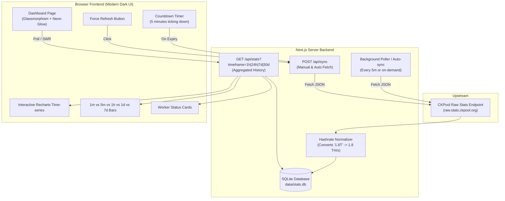

# CKPool Sentinel Web Dashboard - Design Specification

## 1. Overview
The **CKPool Sentinel Dashboard** is a high-performance, real-time web dashboard designed to monitor Bitcoin mining statistics from the CKPool solo mining service (`https://raw.stats.ckpool.org/users/bc1qw7mwuw3nuvf4r9enm39ujzn26gs04gj6t9tx4h`).

It delivers automated 5-minute background data synchronization, persistent historical metrics via a local SQLite database, interactive multi-timeframe charts, and a high-tech "Modern Dark Crypto Terminal" interface with glassmorphism and neon glow aesthetics.

---

## 2. Target Data & Source Endpoint
* **Target Endpoint**: `https://raw.stats.ckpool.org/users/bc1qw7mwuw3nuvf4r9enm39ujzn26gs04gj6t9tx4h`
* **CORS Note**: The upstream server does not send `Access-Control-Allow-Origin` headers. All client requests must be proxied via the Next.js server route to bypass browser CORS restrictions.
* **Payload Structure**:
  ```json
  {
    "hashrate1m": "1.8T",
    "hashrate5m": "1.84T",
    "hashrate1hr": "1.75T",
    "hashrate1d": "1.24T",
    "hashrate7d": "1.11T",
    "lastshare": 1791422670,
    "workers": 2,
    "shares": 1819992546,
    "bestshare": 694365556.3549782,
    "bestever": 694365556,
    "authorised": 1785732216,
    "worker": [
      {
        "workername": "bc1qw7mwuw3nuvf4r9enm39ujzn26gs04gj6t9tx4h",
        "hashrate1m": "1.8T",
        "hashrate5m": "1.84T",
        "hashrate1hr": "1.75T",
        "hashrate1d": "1.24T",
        "hashrate7d": "1.11T",
        "lastshare": 1791422670,
        "shares": 1819990968,
        "bestshare": 694365556.3549782,
        "bestever": 694365556,
        "workers": 0
      }
    ]
  }
  ```

---

## 3. Technology Stack
* **Framework**: Next.js 15+ (App Router, React 19, TypeScript)
* **Styling & Effects**: Tailwind CSS, Framer Motion (animated counters, smooth mount/unmount animations, modal transitions)
* **Icons**: Lucide React
* **Charting**: Recharts with custom SVG gradients and neon glow filters
* **Database**: SQLite (via `better-sqlite3` or `sqlite3`) stored at `data/stats.db`
* **Runtime**: Node.js (v18+ / v22+)

---

## 4. Architecture & Data Flow



---

## 5. Hashrate Parsing Specification
The upstream endpoint uses string suffixes for hashrate (e.g. `1.8T`, `500G`, `12.5M`, `0`).
To plot values on a continuous numerical chart axis, values must be normalized to a standard unit (**TH/s**):
* `1 P` (Petahash) = `1000 TH/s`
* `1 T` (Terahash) = `1.0 TH/s`
* `1 G` (Gigahash) = `0.001 TH/s`
* `1 M` (Megahash) = `0.000001 TH/s`
* `0` or null = `0.0 TH/s`

Both the normalized numerical value and the raw human-readable string will be stored.

---

## 6. Database Schema (`data/stats.db`)

### Table: `snapshots`
* `id` (INTEGER PRIMARY KEY AUTOINCREMENT)
* `timestamp` (INTEGER NOT NULL): Unix timestamp in seconds
* `hashrate_1m` (REAL NOT NULL): Normalized hashrate in TH/s
* `hashrate_5m` (REAL NOT NULL): Normalized hashrate in TH/s
* `hashrate_1hr` (REAL NOT NULL): Normalized hashrate in TH/s
* `hashrate_1d` (REAL NOT NULL): Normalized hashrate in TH/s
* `hashrate_7d` (REAL NOT NULL): Normalized hashrate in TH/s
* `raw_hashrate_1m` (TEXT NOT NULL)
* `raw_hashrate_5m` (TEXT NOT NULL)
* `raw_hashrate_1hr` (TEXT NOT NULL)
* `raw_hashrate_1d` (TEXT NOT NULL)
* `raw_hashrate_7d` (TEXT NOT NULL)
* `workers_count` (INTEGER NOT NULL)
* `shares` (INTEGER NOT NULL)
* `bestshare` (REAL NOT NULL)
* `bestever` (REAL NOT NULL)
* `lastshare` (INTEGER NOT NULL)
* `raw_json` (TEXT NOT NULL): Full original JSON payload for worker inspection

Indexes:
* `idx_snapshots_timestamp` ON `snapshots(timestamp DESC)`

---

## 7. API Routes Specification

### 1. `POST /api/sync`
* **Purpose**: Triggers a fetch from `https://raw.stats.ckpool.org/users/bc1qw7mwuw3nuvf4r9enm39ujzn26gs04gj6t9tx4h`.
* **Behavior**:
  * Fetches fresh JSON from CKPool.
  * Normalizes hashrate metrics.
  * Inserts a new record into `snapshots`.
  * Returns the newly saved snapshot.
* **Error Handling**: If upstream is down, logs the error and returns `{ success: false, error: "Upstream unreachable", cached: <latest_record> }` with status 502/200.

### 2. `GET /api/stats`
* **Query Parameters**:
  * `timeframe`: `1h` (last 1 hour), `24h` (last 24 hours), `7d` (last 7 days), `30d` (last 30 days), `all` (default: `24h`).
* **Response**:
  ```json
  {
    "latest": {
      "timestamp": 1791422670,
      "hashrate_1m": 1.8,
      "hashrate_5m": 1.84,
      "hashrate_1hr": 1.75,
      "hashrate_1d": 1.24,
      "hashrate_7d": 1.11,
      "raw_hashrate_1m": "1.8T",
      "raw_hashrate_5m": "1.84T",
      "raw_hashrate_1hr": "1.75T",
      "raw_hashrate_1d": "1.24T",
      "raw_hashrate_7d": "1.11T",
      "workers_count": 2,
      "shares": 1819992546,
      "bestshare": 694365556.35,
      "bestever": 694365556,
      "lastshare": 1791422670,
      "worker": [ ... ]
    },
    "history": [
      {
        "timestamp": 1791422370,
        "hashrate_1m": 1.80,
        "hashrate_5m": 1.84,
        "hashrate_1hr": 1.75
      }
    ],
    "timeframe": "24h",
    "lastUpdated": 1791422670,
    "nextSyncInSeconds": 240
  }
  ```

---

## 8. Frontend UI/UX Design

### Theme & Styling
* **Background**: Deep Obsidian `#080c14` with ambient radial glow gradients (`amber-500/10` and `cyan-500/10`).
* **Cards**: Translucent dark slate `bg-slate-900/60 backdrop-blur-xl border border-slate-800/80 hover:border-slate-700/80 transition-all rounded-2xl shadow-2xl`.
* **Accents**:
  * Bitcoin Amber: `#F7931A` (Primary metrics, 5m average, shares)
  * Cyber Cyan: `#00F2FE` / `#38BDF8` (1m real-time hashrate, timeline curves)
  * Emerald Green: `#10B981` (Online indicators, Best share badges)

### Visual Components
1. **Header**:
   * Brand: **CKPool Sentinel** with animated mining rig icon.
   * Address display badge: `bc1qw7mwuw3nuvf4r9enm39ujzn26gs04gj6t9tx4h` with copy-to-clipboard button and tooltip.
   * Sync Bar: Live pulse indicator, dynamic 5m countdown widget (`MM:SS`), and a "Force Refresh" button with rotating spinner during sync.
2. **Key Metric Overview Cards (4 Grid Cards)**:
   * **Hashrate Power**: 1m real-time vs 5m smoothed (with animated counter ticker).
   * **Mining Shares**: Total cumulative shares + current Best Share.
   * **All-Time Best Share**: Best ever share found with exponential difficulty representation.
   * **Workers & Activity**: Active worker count + Last share submitted timestamp (formatted as relative time).
3. **Main Hashrate Time-series Chart**:
   * Multi-timeframe toggle buttons: `1H`, `24H`, `7D`, `30D`, `ALL`.
   * Recharts Area/Line chart with smooth cubic bezier curves (`monotone`).
   * Dual gradient neon fills (Cyan for 1m, Amber for 5m, Green for 1h).
   * Glassmorphism interactive hover tooltip displaying exact values and timestamps.
4. **Source Timeframe Comparison Card**:
   * Visual comparison of CKPool's 5 native timeframes: `1m`, `5m`, `1hr`, `1d`, `7d`.
   * Interactive horizontal meters showing mining stability variance.
5. **Worker Nodes Details Table / Cards**:
   * Detailed breakdown of active workers from the JSON payload.
   * Worker name, individual hashrates, shares, and last seen activity.

---

## 9. Error Handling & Resilience
* **Network Failures**: Non-blocking toast/banner alert if upstream API is slow or fails; UI smoothly falls back to the latest recorded SQLite data.
* **Database Migration**: Automatic creation of `data/` folder and `snapshots` table on server startup.
* **Cold Start / Empty History**: If the database is newly initialized, the server immediately triggers an initial sync to populate the first snapshot.

---

## 10. Success Criteria & Verification
1. Dashboard loads smoothly with no console errors or CORS errors.
2. Background sync fetches data every 5 minutes and saves to SQLite.
3. "Force Refresh" button immediately queries CKPool and updates the UI and countdown timer.
4. Timeframe toggle (`1H`, `24H`, `7D`, etc.) updates the chart data correctly.
5. UI reflects modern 2026 aesthetics with dark mode, glowing accents, glassmorphism, and responsive layout for mobile and desktop.
